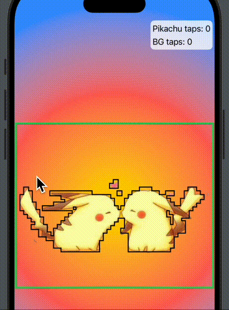

# Shape From Image Non-Transparent Pixel

Creating a Shape from an Image's non-transparent pixel. 
```
private struct ImageShape: Shape  {
    var image: UIImage?
    
    // anything below alphaThreshold will be considered as transparent
    var alphaThreshold: CGFloat = 0.05
    
    // to expensive to loop through individual pixel
    // max of maxSteps on width or maxSteps on height
    var maxSteps: Int = 50

    
    func path(in rect: CGRect) -> Path {
        print(rect)
        
        guard let cgImage = self.image?.cgImage else { return Path() }
        let width = cgImage.width
        let height = cgImage.height
        
        let scaleX = rect.width / CGFloat(width)
        let scaleY = rect.height / CGFloat(height)
        
        let stepSize: Int = max(width / maxSteps, height / maxSteps)

        let rectSize = CGFloat(stepSize) * 1.1
        let unitRect = Rectangle()
            .size(.init(width: rectSize, height: rectSize))
            .transform(.init(translationX: -rectSize/2, y: -rectSize/2))
        
        var finalShape: (any Shape)? = nil
         
        // to expensive to loop through individual pixel
        for i in stride(from: 0, to: width, by: stepSize) {
            for j in stride(from: 0, to: height, by: stepSize) {
                let floatX = CGFloat(i)
                let floatY = CGFloat(j)
                
                guard let alpha = cgImage.getAlpha(at: CGPoint(x: floatX, y: floatY)) else { continue }
                if alpha <= alphaThreshold {
                    continue
                }
                
                let offsetX = floatX * scaleX
                let offsetY = floatY * scaleY

                if finalShape == nil {
                    finalShape = unitRect.offset(x: offsetX, y: offsetY)
                    continue
                }
                
                
                finalShape = finalShape?.union(
                    unitRect
                        .offset(x: offsetX, y: offsetY)
                )
            }
        }
        

        let path = finalShape?.path(in: rect) ?? Path()
        
        return path
    }

}

private extension CGImage {
    func getAlpha(at point: CGPoint) -> CGFloat? {
        let alphaInfo = self.alphaInfo
        if alphaInfo != .premultipliedLast && alphaInfo != .premultipliedFirst {
            return nil
        }
        
        guard let provider = self.dataProvider else { return nil }
        
        let pixelData = provider.data
        
        let data: UnsafePointer<UInt8> = CFDataGetBytePtr(pixelData)
        
        let pixelInfoIndex: Int = ((Int(self.width) * Int(point.y)) + Int(point.x)) * 4
        
        if alphaInfo == .premultipliedLast {
            return CGFloat(data[pixelInfoIndex+3]) / CGFloat(255.0)
        } else {
            return CGFloat(data[pixelInfoIndex]) / CGFloat(255.0)
        }
    }

}
```


Usage: 
- add it as a `contentShape` modifier to an image to pass through gestures on transparent pixels.

```
if let uiImage = UIImage(named: "transparent-bg-pikachu") {
    let imageShape = ImageShape(image: uiImage)
    
    Image(uiImage: uiImage)
        .resizable()
        .scaledToFit()
        .frame(width: 400)
        .onTapGesture {
            pikachuTaps += 1
        }
        .contentShape(imageShape)
        .border(.white, width: 4)
        .overlay(content: {
            imageShape
                .stroke(style: .init(lineWidth: 2))
                .border(.green, width: 4)

        })
}
```





